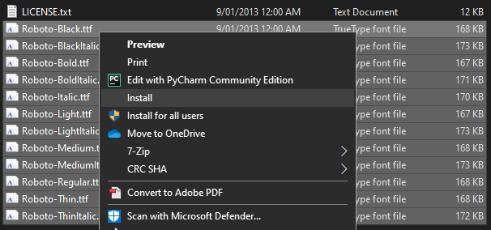
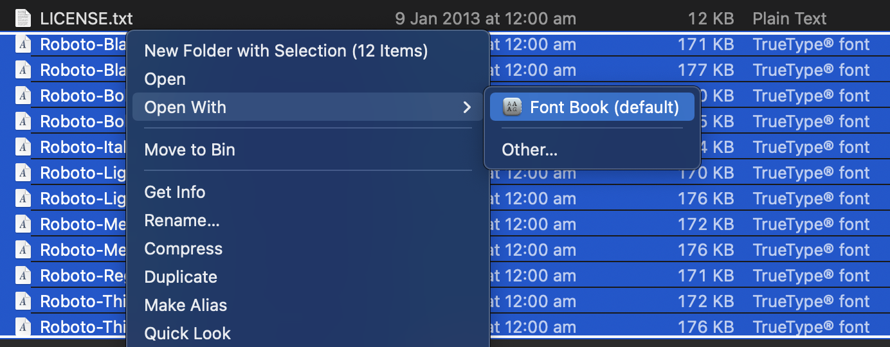

# EWorkout Production: OBS Templates

## Download and install OBS

OBS Studio is free and open source software. You can download it from [https://obsproject.com/download](https://obsproject.com/download)

## Download the EWorkout Production package

You should have been sent a file named `Valor-Templates-EWorkout-Production.zip` or similar. **Extract the ZIP file** somewhere you won't lose it, for example your desktop folder.

## Install the Roboto font

!!! note
    [Roboto](https://fonts.google.com/specimen/Roboto) is [licensed](https://fonts.google.com/specimen/Roboto#license) under the [Apache License, Version 2.0](https://www.apache.org/licenses/LICENSE-2.0).

Inside the `Valor-Templates-EWorkout-Production` folder, you will see a `Roboto.zip` file. **Extract it** and you will be left with a number of `Roboto-*.ttf` files.

### Windows

On Windows, you can install all fonts at once by **selecting them all, right clicking, and choosing either `Install` or `Install for all users`**.

### macOS

On macOS, you can install all fonts at once by **selecting them all, right clicking, and then choosing `Open With > Font Book`**.

This will open a preview window, where you must **click `Install Font` at the bottom right**.

